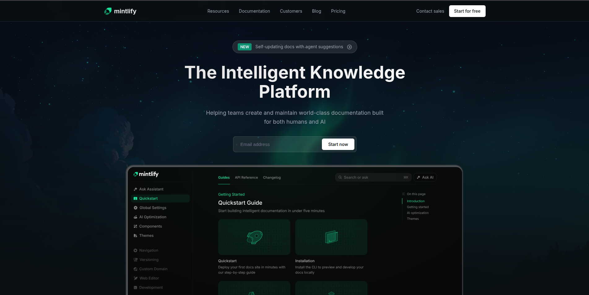

# Mintlify Landing Page Clone

This project is a static HTML and CSS clone of the Mintlify landing page, created as part of an assignment.

---

## Sections Recreated

- Top Navigation Bar  
- Hero Section (headline, description, email input, CTA, background illustration)  
- Documentation Preview  
- Trusted By / Company Logos  
- Feature Highlights  
- Intelligent Assistant UI Preview  
- Enterprise Features Section  
- Customer Story / Case Study  
- Final Call-To-Action  
- Footer with multi-column links and company info  

---

## Fonts Used

- **Inter** (Google Fonts)

```css
font-family: "Inter", sans-serif;
```

## Colors Used

Defined using CSS variables:

- **Background:** `#0a0f12`, `#0f1419`, `#151c22`
- **Accent:** `#0d9373`, `#23b193`
- **Text:** `#ffffff`, `#9ca3af`, `#6b7280`
- **Borders:** `#1f2937`, `#2d3748`




[Hosted Link](https://mohammad-1105.github.io/mintlify-landing-page-clone/)